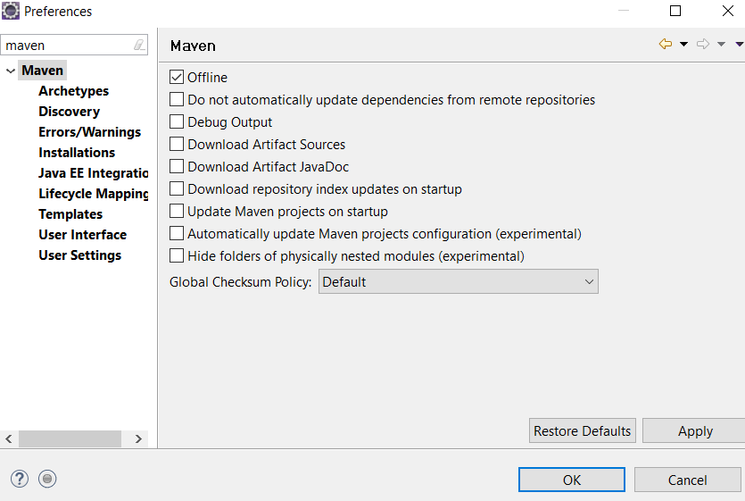
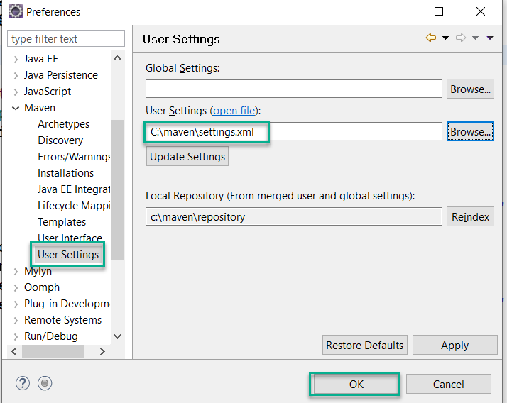

# Maven repository for Offline access to Spring5 & Spring Boot 2 dependencies.

This repository contains a maven repository for most common spring5 and spring boot dependencies. The objective is simple, to allow every one to download and use offline maven repository for spring projects.

## PLEASE NOTE: 
    
*   If you are NOT behind any PROXY and your maven installation is able to pull all dependencies, then DO NOT USE this repository.

*   I have created this repository for people who are behind proxy and having difficulty in downloading any dependency through maven.

*   This repository would work ONLY IF GIT is allowed on your network.

### Steps to setup maven repository

1.  Clone this repository into your system in directory "c:\maven"

    ```git clone https://github.com/mahendra-shinde/maven-repo-springboot.git c:\maven```

    Or Use download button to   download it as ZIP

    Extract contents of _ZIP_ into C:\maven directory

2.  Open C:\Maven directory with file explorer, and verify that you have one "settings.xml" file along with "repository" folder.
3.  Open your **Spring ToolSuite** with new Workspace and then goto _Window_ -> _Preferences_ -> Search for "Maven"

4.  Make sure you select "Offline" and clear ALL other options. Just like screenshot attached below:

    

5.   Now, Goto "User Settings" from left side section and change the location of maven settings file.

        

6.  Start creating Spring Boot projects with Spring Boot version 2.1.4